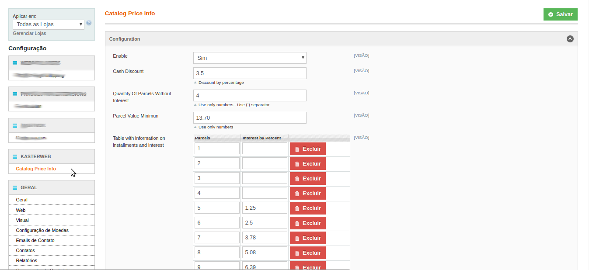
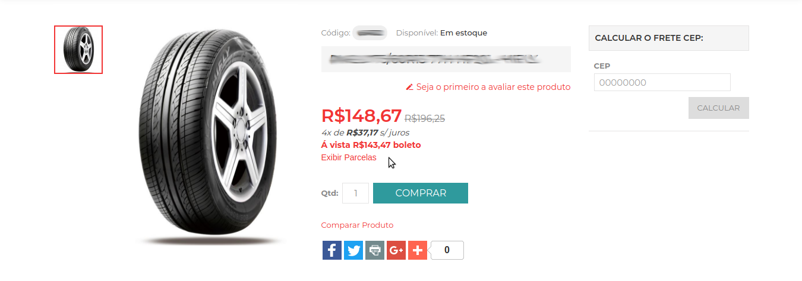
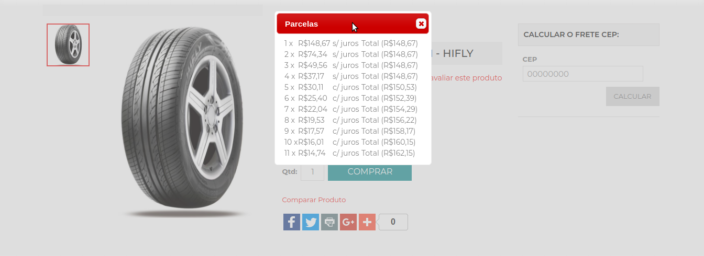

# KASTERWEB Catalog Prices Parcels
Module designed to display product plots on the product page
This module does not contemplate customizing the front end.

## Configure Module By Modman

To install Modman, you can either install the library in your user's root folder, or you can install Modman globally.
Regardless of which option you choose, first run one of these two scripts to download the Modman repo.
```
bash < <(wget -q --no-check-certificate -O - https://raw.github.com/colinmollenhour/modman/master/modman-installer)

or

bash < <(curl -s -L https://raw.github.com/colinmollenhour/modman/master/modman-installer)
```

Init Modman
 ```
modman init
 ```
 
Clone project using modman.
 ```
modman clone https://github.com/luanalves/Kasterweb_CatalogPrice.git
 ```
Install by modman
 ```
modman run deploy-all
 ```
 Run Setup Magento by N98
 
 ```
php n98-magerun.phar cache:clean ; php n98-magerun.phar sys:setup:run
 ```
## Add entry ".modman" in .gitignore


## Configure 
Access
admin -> systems -> settings
Kasterweb -> Catalog Price Info




## Example of use
Add Code in Front End Page
```sh
<?php if (Mage::helper('kasterweb_catalogprice')->_enable()) : ?>
    <div class="kprice-info">
        <div class="kprice-info-parcela">
            <?php $valueParcelWithoutInterest = $_product->getValueParcelWithoutInterest() ;?>
            <?php echo $_product->getQtyParcelsWithoutInterest() . 'x de <b>' .$valueParcelWithoutInterest . '</b> s/ juros <br />'; ?>
        </div>
        <div class="kprice-info-desconto">
            <?php echo 'Á vista ' . $_product->getCashDiscount() . ' boleto <br />'; ?>
        </div>
        <?php if (Mage::helper('kasterweb_catalogprice')->validateParcelValueMinimun($_finalPrice)): ?>

        <a href="javascript:void(0)" id="button-open-parcels-<?php echo $_product->getId();?>">Exibir Parcelas</a>
        <div class="table-parcels hidden" id="table_parcels-<?php echo $_product->getId();?>">
            <?php $parcels = $_product->getTableParcelsWithoutInterest();
            if (!empty($parcels)):?>
                <table>
                    <?php foreach ($parcels as $parcel): ?>
                        <?php $total = Mage::helper('kasterweb_catalogprice')->calculateInterest($parcel['interest'], $_finalPrice); ?>
                        <?php $valueParcel = $total / $parcel['parcel']; ?>
                        <?php $valueParcelFormat = Mage::helper('core')->currency($total / $parcel['parcel'], true, false); ?>
                        <?php if (Mage::helper('kasterweb_catalogprice')->validateParcelValueMinimun($valueParcel)): ?>
                            <tr>
                                <td> <?php echo $parcel['parcel']; ?> x</td>
                                <td><?php echo $valueParcelFormat; ?></td>
                                <td>&nbsp;</td>
                                <td>
                                    <?php if (!empty($parcel['interest'])): ?>
                                        c/ juros
                                    <?php else: ?>
                                        s/ juros
                                    <?php endif; ?>
                                </td>
                                <td>&nbsp;</td>
                                <td>Total (<?php echo Mage::helper('core')->currency($total, true, false) ?>)
                                </td>
                            </tr>
                        <?php endif; ?>
                    <?php endforeach; ?>
                </table>
            <?php endif; ?>
            <script>
                $j(document).ready(function () {
                    $j("#button-open-parcels-<?php echo $_product->getId();?>").on("click", function () {
                        $j("#table_parcels-<?php echo $_product->getId();?>").removeClass('hidden');
                        $j("#table_parcels-<?php echo $_product->getId();?>").dialog({
                            title: "Parcelas",
                            modal: true
                        });
                    });
                });

            </script>
        </div>
        <?php endif ?>
    </div>
<?php endif ?>
```


PRODUCT VIEW
<hr />



